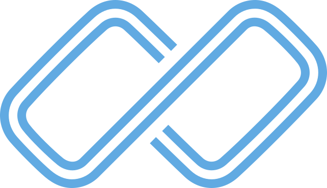

# 🃏 Basecard - Trading Card Collection Manager

<p align="center">
  
</p>

<p align="center">
  <strong>Platform per collezionisti di carte da gioco (Pokemon TCG, Magic: The Gathering, Yu-Gi-Oh!)</strong>
</p>

---

## 📖 Overview

**Basecard** è una piattaforma web completa per gestire collezioni di carte da gioco, monitorare prezzi, costruire mazzi e valutare il valore della propria collezione nel tempo.

### 🎯 Core Features
- 📦 **Collection Management**: Traccia tutte le tue carte con quantità e varianti
- 💰 **Price Tracking**: Prezzi aggiornati da TCGCSV (USA) e Cardmarket (EU)
- 🎴 **Deck Builder**: Crea e valuta mazzi con statistiche dettagliate
- 📊 **Analytics**: Monitora l'andamento del valore della tua collezione
- 🎮 **Multi-Game**: Supporto per Pokemon, MTG e Yu-Gi-Oh!
- 🌍 **Multi-Language**: Interfaccia in Inglese, Italiano e Danese
- 💳 **Subscription Plans**: Tier Basic, Advanced e Premium

---

## 🆕 Recent Updates (January 2026)

### ✨ Homepage Modular Redesign
- **4 New Sections** with modular architecture:
  - 🎯 **The Three Pillars**: Detailed features showcase (Track, Value, Play)
  - 👥 **Social Proof**: Stats, testimonials, trust badges
  - 🔄 **How It Works**: 4-step process visualization
  - 💰 **Pricing Teaser**: Dynamic pricing from database

### 🎨 Pricing Page Modernization
- Modern card design with gradients (Green/Blue-Purple/Purple-Pink)
- **Monthly/Yearly toggle** with JavaScript
- Dynamic prices from `pricing_plans` table
- Automatic savings calculation
- Recommended plan highlighting with scale effect
- Enhanced FAQ section with numbered items
- Enterprise section with gradient CTA

### 🏗️ Architecture Improvements
- **Modular blade partials**: `resources/views/home/*.blade.php`
- **Separate translation files**: `resources/lang/{da,it,en}/home/*.php`
- Features page fully modularized (7 sections)
- Easy maintenance and extensibility

### 🔧 Technical Fixes
- RapidAPI configuration moved to `.env`
- Cardmarket services null-safety improvements
- View cache optimization

---

## 📚 Documentation Hub

### Core Documentation
- **[PROJECT_STATUS.md](PROJECT_STATUS.md)** - ⭐ Complete project status, features, architecture (updated Feb 2, 2026)
- **[ROADMAP.md](ROADMAP.md)** - Future development roadmap and planned features

### Implementation Guides
- **[NEW_GAME_IMPLEMENTATION_GUIDE.md](NEW_GAME_IMPLEMENTATION_GUIDE.md)** - Complete guide for adding new card games (3240+ lines)
- **[LORCANA_QUICKSTART.md](LORCANA_QUICKSTART.md)** - Quick start for Disney Lorcana implementation
- **[CMAPI_IMPLEMENTATION_STATUS.md](CMAPI_IMPLEMENTATION_STATUS.md)** - 🆕 Current status of Lorcana/One Piece (70% complete)
- **[TODO_CMAPI_COMPLETION.md](TODO_CMAPI_COMPLETION.md)** - 🆕 Step-by-step TODO checklist for CMAPI completion

### Operation Guides
- **[OPERATIONS.md](OPERATIONS.md)** - Deployment, maintenance, troubleshooting
- **[CRON_SETUP.md](CRON_SETUP.md)** - Scheduled tasks configuration
- **[CARDMARKET_PRICE_SYNC_GUIDE.md](CARDMARKET_PRICE_SYNC_GUIDE.md)** - CardMarket pricing integration

### Stripe & Billing
- **[STRIPE_SETUP_GUIDE.md](STRIPE_SETUP_GUIDE.md)** - Complete Stripe integration guide
- **[STRIPE_RECURRING_IMPLEMENTATION.md](STRIPE_RECURRING_IMPLEMENTATION.md)** - Recurring subscriptions
- **[SUBSCRIPTION_RENEWAL_GUIDE.md](SUBSCRIPTION_RENEWAL_GUIDE.md)** - Renewal flow documentation

---

## 🛠️ Tech Stack

- **Framework**: Laravel 11 (PHP 8.2+)
- **Frontend**: Blade Templates + Alpine.js + Tailwind CSS
- **Database**: MySQL 8.0+
- **Email**: Brevo SMTP
- **Payments**: Stripe (Subscriptions + One-time)
- **APIs**: TCGCSV, Cardmarket, RapidAPI

---

## 🚀 Quick Start

### Prerequisites
- PHP 8.2+
- Composer
- Node.js & npm
- MySQL 8.0+

### Installation

1. **Clone repository**
```bash
git clone https://github.com/cyberfactoryIT/pokebase.git
cd pokebase
```

2. **Install dependencies**
```bash
composer install
npm install
```

3. **Environment setup**
```bash
cp .env.example .env
php artisan key:generate
```

4. **Configure `.env`**
```env
APP_URL=http://localhost
DB_DATABASE=basecard
DB_USERNAME=root
DB_PASSWORD=

ORGANIZATIONS_ENABLED=false
DEFAULT_GAME_ID=1

STRIPE_KEY=your_stripe_key
BREVO_API_KEY=your_brevo_key
```

5. **Database setup**
```bash
php artisan migrate
php artisan db:seed
```

6. **Import card data**
```bash
php artisan tcgcsv:import --game=pokemon --only=all
```

7. **Build assets**
```bash
npm run build
```

8. **Start server**
```bash
php artisan serve
```

Visit `http://localhost:8000`

---

## 📚 Documentation

- **[PROJECT_STATUS.md](PROJECT_STATUS.md)** - Status completo applicazione, architecture, features
- **[OPERATIONS.md](OPERATIONS.md)** - Comandi operativi e deployment
- **[ROADMAP.md](ROADMAP.md)** - Sviluppi futuri pianificati
- **[DEPRECATION.md](DEPRECATION.md)** - Features e codice deprecato

---

## 🔧 Common Operations

### Deploy to Production
```bash
./deploy.sh
```

### Import Card Data
```bash
# Pokemon
php artisan tcgcsv:import --game=pokemon --only=all

# Magic: The Gathering
php artisan tcgcsv:import --game=mtg --only=all

# Yu-Gi-Oh
php artisan tcgcsv:import --game=yugioh --only=all
```

### Create Admin User
```bash
php artisan make:superadmin
```

### Clear Cache
```bash
php artisan cache:clear
php artisan config:clear
php artisan route:clear
php artisan view:clear
```

---

## 🧪 Testing

```bash
# Run all tests
php artisan test

# Run with coverage
php artisan test --coverage
```

---

## 🌍 Multi-Language Support

Supported languages:
- 🇬🇧 English (EN)
- 🇮🇹 Italiano (IT)
- 🇩🇰 Dansk (DA)

Translation files in `resources/lang/{locale}/`

---

## 💳 Subscription Tiers

| Tier | Price | Features |
|------|-------|----------|
| **Basic** | Free | Limited deck creation, no price visibility |
| **Advanced** | €9.99/mo | Full price access, unlimited decks |
| **Premium** | €19.99/mo | All Advanced + analytics, priority support |

**Deck Evaluation**: €9.99 one-time (365 days price access)

---

## 🎮 Supported Games

- 🔴 **Pokemon TCG** (Primary)
- 🔵 **Magic: The Gathering**
- 🟡 **Yu-Gi-Oh!**

Users can switch between games via navbar dropdown.

---

## 🏗️ Project Structure

```
pokebase/
├── app/
│   ├── Console/Commands/     # Artisan commands
│   ├── Http/Controllers/     # Controllers
│   ├── Models/              # Eloquent models
│   ├── Services/            # Business logic
│   │   ├── RapidApi/        # RapidAPI integration
│   │   └── Cardmarket/      # Cardmarket services
│   └── Policies/            # Authorization
├── config/                  # Configuration files
│   ├── rapidapi.php         # RapidAPI config
│   └── cardmarket.php       # Cardmarket config
├── database/
│   ├── migrations/          # Database migrations
│   └── seeders/            # Database seeders
├── public/                  # Public assets
├── resources/
│   ├── css/                # Stylesheets
│   ├── js/                 # JavaScript
│   ├── lang/               # Translations
│   │   ├── da/            # Danish
│   │   │   ├── features/  # Features page sections
│   │   │   └── home/      # Homepage sections
│   │   ├── it/            # Italian
│   │   └── en/            # English
│   └── views/              # Blade templates
│       ├── home/          # Homepage partials
│       │   ├── pillars.blade.php
│       │   ├── social.blade.php
│       │   ├── howitworks.blade.php
│       │   └── pricingteaser.blade.php
│       └── pages/
│           ├── features/  # Features page partials
│           └── pricing.blade.php
├── routes/
│   ├── web.php             # Web routes
│   └── auth.php            # Auth routes
├── storage/                 # Logs, cache, uploads
└── tests/                   # PHPUnit tests
```

---

## 🔒 Security

- Email verification required
- Optional 2FA (Two-Factor Authentication)
- CSRF protection
- Password reset via email
- Stripe secure payments

---

## 🐛 Common Issues

### "Class not found"
```bash
composer dump-autoload
php artisan clear-compiled
```

### Routes not working
```bash
php artisan route:clear
php artisan route:cache
```

### Session issues
```bash
php artisan session:clear
php artisan cache:clear
```

---

## 📝 Environment Variables

### Critical Settings
```env
ORGANIZATIONS_ENABLED=false  # DO NOT CHANGE
DEFAULT_GAME_ID=1           # 1=Pokemon, 2=MTG, 3=YGO
```

### Email (Brevo)
```env
MAIL_MAILER=smtp
MAIL_HOST=smtp-relay.brevo.com
MAIL_PORT=587
MAIL_USERNAME=your_brevo_email
MAIL_PASSWORD=your_brevo_key
MAIL_FROM_ADDRESS=noreply@basecard.dk
```

### Payments (Stripe)
```env
STRIPE_KEY=pk_live_xxx
STRIPE_SECRET=sk_live_xxx
STRIPE_WEBHOOK_SECRET=whsec_xxx
```

### APIs
```env
# Pokemon TCG API
POKEMON_API_BASE_URL=https://api.pokemontcg.io/v2
POKEMON_API_KEY=your_pokemon_api_key
POKEMON_API_PAGE_SIZE=250

# RapidAPI Cardmarket TCG
RAPIDAPI_CARDMARKET_ENABLED=true
RAPIDAPI_KEY=your_rapidapi_key
RAPIDAPI_CARDMARKET_HOST=cardmarket-api-tcg.p.rapidapi.com
RAPIDAPI_CARDMARKET_BASE_URL=https://cardmarket-api-tcg.p.rapidapi.com
RAPIDAPI_RATE_LIMIT=50

# Cardmarket (Legacy)
CARDMARKET_APP_TOKEN=your_token
```

---

## 👥 Contributing

1. Fork the repository
2. Create feature branch (`git checkout -b feature/amazing-feature`)
3. Commit changes (`git commit -m 'Add amazing feature'`)
4. Push to branch (`git push origin feature/amazing-feature`)
5. Open Pull Request

---

## 📄 License

This project is proprietary software owned by Basios ApS.

---

## 🔗 Links

- **Production**: [https://basecard.dk](https://basecard.dk)
- **Support**: support@basecard.dk
- **Documentation**: See `PROJECT_STATUS.md`

---

## 👨‍💻 Development

### Watch for changes
```bash
npm run dev
```

### Debug mode
```bash
# In .env
APP_DEBUG=true
DB_LOG_QUERIES=true
```

### Queue worker
```bash
php artisan queue:work
```

---

## 🎨 Design System

- **Theme**: Dark mode (black #000, card bg #161615)
- **Primary Color**: Blue gradient
- **Font**: System fonts
- **Logo**: `/public/images/logo_basecard.svg`

---

## 📊 Database

### Main Tables
- `users` - Users with default game
- `games` - Pokemon, MTG, Yu-Gi-Oh!
- `tcgcsv_products` - Card catalog
- `tcgcsv_prices` - USA pricing
- `cardmarket_prices` - EU pricing
- `user_collection` - User cards
- `decks` - User decks
- `subscriptions` - Active subscriptions

---

## ⚡ Performance

- Route caching enabled in production
- View caching enabled
- Database indexes on foreign keys
- Lazy loading for images
- CDN for static assets (planned)

---

## 📱 Mobile

- Fully responsive design
- Touch-friendly UI
- PWA support (planned)

---

Made with ❤️ by Basios ApS
